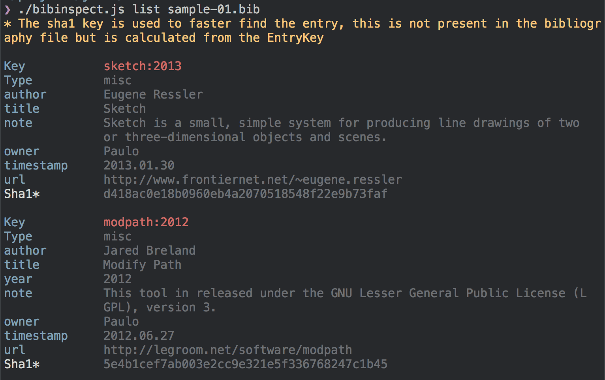
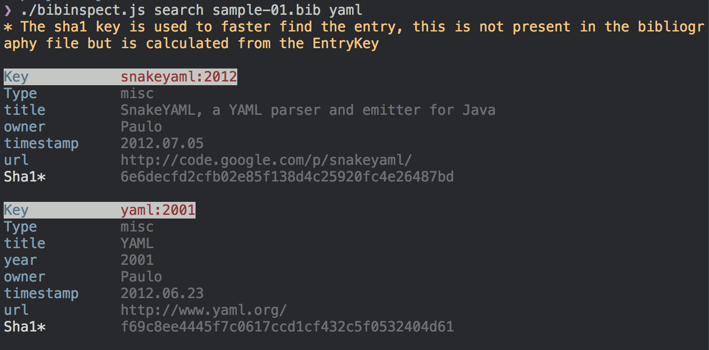

Bibinspect
=============

Inspect bibtext files from command line. 

# Usage
There are 2 commands: `list` and `search`.

```bash
$ bibinspect list references.bib
// Lists all entries

$ bibinspect search references.bib "hello"
// Searches for the query "hello" in everything, first tries to match with key and short (4 chars) sha1 of key
```

```bash
$ bibinspect --help
```

## List
List all entries in the file



## Search
You can search with free text. `bibinspect search <file> "query"`. The first property that matches will be highlighted. 



You could also search with the **sha1** hash of the entries key. This is often very short, which is nice. With 3-4 chars you should find the correct entry. This is especially usefull when using the `--short` flag of list, which only lists key and title, plus the short sha1 hash. 

# Licence
MIT

Im using the lib [bib2json](https://github.com/mayanklahiri/bib2json) by [mayanklahiri](https://github.com/mayanklahiri) which uses BSD license. 